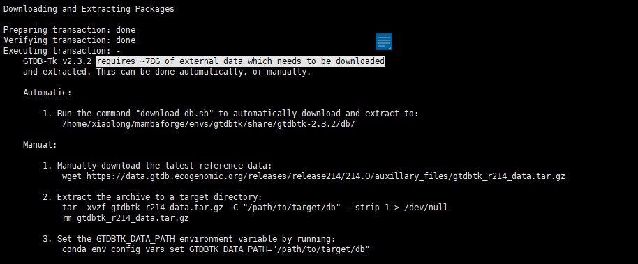
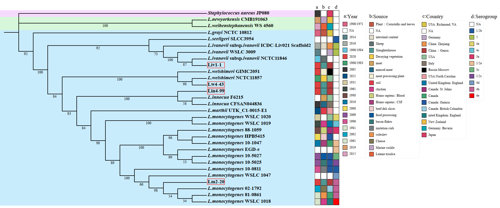

# Bacteria tree

Yumei Qi, Xiaolong Li

# This is the complete process of building a bacterial evolutionary tree (gtdbtk)

1. Bacteris name(***[NCBI](https://www.ncbi.nlm.nih.gov/)***): n = 30

   ```shell
   AP017922.1 CP013285.1 CP013286.1 CP013287.1 Lin4-99 Liv1-1 Lm2-20 Lw4-43 NC_003210.1 NC_013891.1 NZ_CP006861.1 NZ_CP006874.1 NZ_CP007169.1 NZ_CP007172.1 NZ_CP007194.1 NZ_CP007196.1 NZ_CP007461.1 NZ_CP008770.1 NZ_CP011102.1 NZ_CP013289.1 NZ_CP019165.1 NZ_CP045743.1 NZ_CP089090.1 NZ_CP103399.1 NZ_CP113980.1 NZ_CP122330.1 NZ_LR134483.1 NZ_LT906444.1 NZ_LT906478.1 PPPJ01000002.1
   ```

   Run the following code when the 30 fasta sequences are downloaded:

   ```shell
   cp [A-Z]* ./workDir
   ```

   

2. Linux analysis environment ***[gtdbtk](https://github.com/Ecogenomics/GTDBTk)***: ***<span style="color:red"> need download data(78G)</span>***

   ```shell
   conda create -n gtdbtk
   conda install -c bioconda gtdbtk
   ```

   

   After downloading the 78G supplementary data, continue to configure the gtdbtk operating environment according to the requirements of gtdbtk

3. Run gtdbtk and ***[iqtree](http://www.iqtree.org/)***

   ```shell
   cd workDir
   genome_dir="fasta"
   out_dir="fasta_output"
   gtdbtk classify_wf \
   --genome_dir ${genome_dir} \
   --out_dir ${out_dir} \
   --extension .fasta \
   --cpus 50 \
   --skip_ani_screen 1>gtdbtk_n30.log && \
   echo ">------" >> gtdbtk_n30.log && \
   iqtree \
   -s ${out_dir}/align/gtdbtk.bac120.user_msa.fasta.gz \
   -o AP017922.1 \
   -m MFP \
   -nt 50 \
   -bb 1000 \
   -redo \
   -mredo 1>>gtdbtk_n30.log
   ```

4. Graph: ***[iTol](https://itol.embl.de/)***

